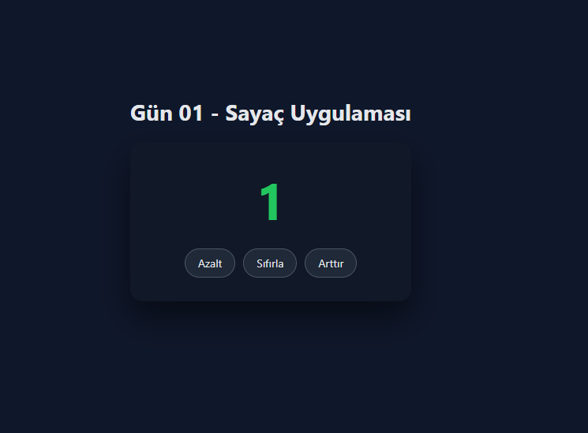

# Gün 01 – Sayaç Uygulaması (Counter App)

Bu proje, **30 Gün / 30 JavaScript Projects** serimin 1. gün projesidir.  
Amaç: JavaScript ile temel DOM manipülasyonu, event listener kullanımı ve basit animasyon mantığını hatırlamak.

---

## 🎯 Proje Özeti

Bu uygulamada kullanıcı;

- **Arttır** butonu ile sayıyı yükseltebilir
- **Azalt** butonu ile sayıyı azaltabilir
- **Sıfırla** butonu ile sayacı sıfırlayabilir
- Sayı pozitif olduğunda **yeşil**, negatif olduğunda **kırmızı**, sıfır olduğunda **gri** renkte gösterilir
- Her değişimde küçük bir **scale animasyonu** uygulanır

Tamamen **HTML + CSS + JavaScript** ile yapılmıştır.

---

## 🖼️ Ekran Görüntüsü

`assets` klasörü içinde yer alan görüntü:

---

## 🛠️ Kullanılan Teknolojiler

- **HTML5**
- **CSS3**
- **Vanilla JavaScript**
- Temel DOM işlemleri
- Event Listener’lar
- Basit animasyon efektleri

---

## 📁 Proje Yapısı
