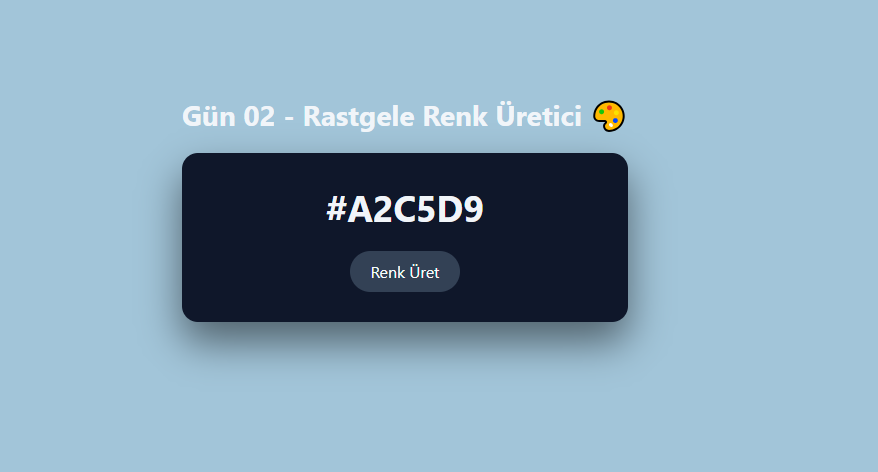

# Gün 02 – Rastgele Renk Üretici (Random Color Generator)

Bu proje, **30 Gün / 30 JavaScript Projects** serimin 2. gün projesidir.  
Amaç: JavaScript ile rastgele HEX renk üretmeyi, DOM üzerinden stil değiştirmeyi ve animasyon eklemeyi öğrenmek.

---

## 🎯 Proje Özeti

Kullanıcı **“Renk Üret”** butonuna bastığında:

- Arka plan rengi rastgele bir HEX değerine dönüşür
- Üretilen renk kodu ekranda gösterilir
- Yazıya küçük bir büyüme animasyonu uygulanır
- Renk her seferinde tamamen rastgele oluşturulur

Proje tamamen **HTML + CSS + JavaScript** ile geliştirilmiştir.

---

## 🖼️ Ekran Görüntüsü

Aşağıdaki görsel `assets` klasöründe yer almaktadır:

---

## 🛠️ Kullanılan Teknolojiler

- **HTML5**
- **CSS3**
- **Vanilla JavaScript**
- `Math.random()` ile rastgele değer üretme
- DOM manipülasyonu
- Temel animasyonlar

---

## 📁 Proje Yapısı
