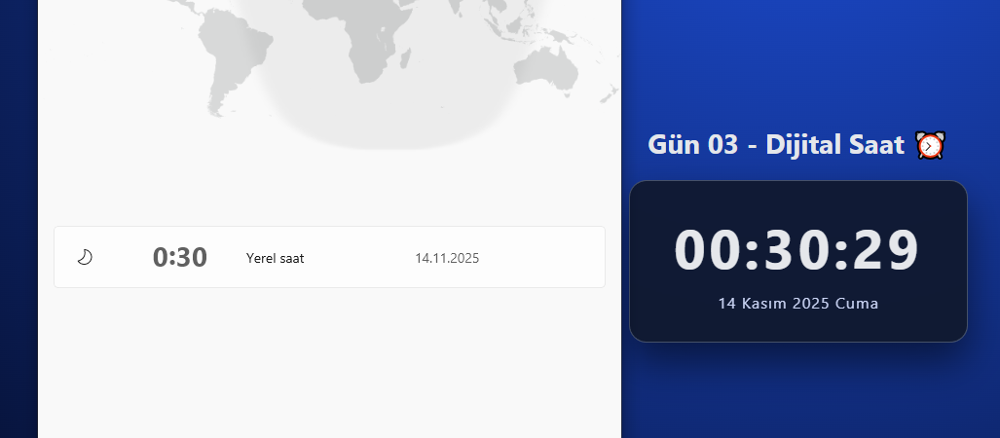

# Gün 03 – Dijital Saat (Digital Clock)

Bu proje, **30 Gün / 30 JavaScript Projects** serimin 3. gün projesidir.  
Amaç: JavaScript'in `Date` objesini kullanarak gerçek zamanlı bir dijital saat oluşturmak.

---

## 🎯 Proje Özeti

Bu dijital saat uygulaması:

- Saat, dakika ve saniyeyi **gerçek zamanlı** olarak gösterir
- Her saniye otomatik olarak kendini günceller
- Tarihi; **gün ay yıl + gün adı** formatında gösterir
- Saat kısmına küçük bir animasyon eklenmiştir

Tamamen **HTML + CSS + Vanilla JavaScript** ile geliştirilmiştir.

---

## 🖼️ Ekran Görüntüsü

`assets` klasöründe yer alan ekran görüntüsü:

---

## 🛠️ Kullanılan Teknolojiler

- **HTML5**
- **CSS3**
- **Vanilla JavaScript**
- `Date` objesi
- `setInterval` ile periyodik güncelleme
- DOM manipülasyonu

---

## 📁 Proje Yapısı
