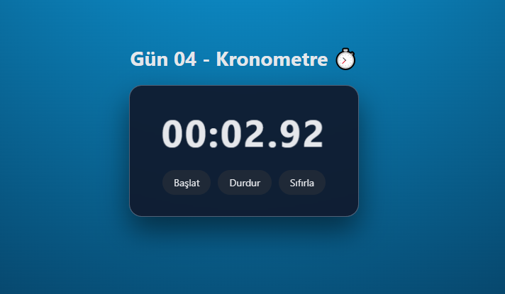

# Gün 04 – Kronometre (Stopwatch)

Bu proje, **30 Gün / 30 JavaScript Projects** serimin 4. gün projesidir.  
Amaç: JavaScript ile kronometre mantığını öğrenmek, `setInterval`, zaman hesaplama ve DOM güncellemeleri üzerine pratik yapmak.

---

## 🎯 Proje Özeti

Bu kronometre uygulaması:

- **Başlat** butonu ile çalışmaya başlar
- **Durdur** butonu ile o andaki süreyi durdurur
- **Sıfırla** butonu ile süreyi 00:00.00'a resetler
- Her 10 milisaniyede bir ekranı günceller
- Küçük bir büyüme animasyonu ile daha canlı bir his verir
- Arka planda modern bir gradient + cam efekti kullanılmıştır

Tamamen **HTML + CSS + Vanilla JavaScript** ile geliştirilmiştir.

---

## 🖼️ Ekran Görüntüsü

`assets` klasöründe yer alan ekran görüntüsü:

---

## 🛠️ Kullanılan Teknolojiler

- **HTML5**
- **CSS3**
- **Vanilla JavaScript**
- `setInterval` ile zamanlayıcı oluşturma
- `Date.now()` ile gerçek zamanlı süre hesaplama
- DOM manipülasyonu
- Animasyon (CSS transform)

---

## 📁 Proje Yapısı
