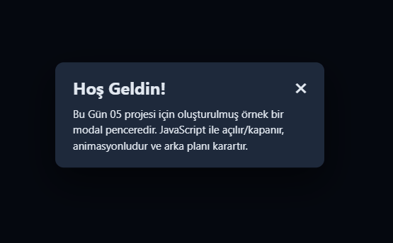

# Gün 05 – Modal Popup (Açılır Pencere)

Bu proje, **30 Gün / 30 JavaScript Projects** serimin 5. gün projesidir.  
Amaç: JavaScript kullanarak açılır modal penceresi oluşturmak, animasyonlu açılma–kapanma mantığını öğrenmek ve kullanıcı etkileşimini yönetmektir.

---

## 🎯 Proje Özeti

Bu modal popup uygulaması:

- “Modalı Aç” butonuna basınca karanlık _overlay_ ile birlikte açılır
- Modal üzerinde bulunan **✖** butonuna basıldığında kapanır
- Overlay (karartma alanı) tıklanınca kapanır
- **ESC** tuşuna basıldığında kapanır
- Açılırken ve kapanırken **animasyonlu** bir geçiş efekti kullanılır
- Cam efekti + modern koyu tema görünümüne sahiptir

Uygulama tamamen **HTML + CSS + Vanilla JavaScript** ile geliştirilmiştir.

---

## 🖼️ Ekran Görüntüsü

`assets` klasöründe bulunan ekran görüntüsü:

---

## 🛠️ Kullanılan Teknolojiler

- **HTML5**
- **CSS3**
- **Vanilla JavaScript**
- Event Listener kullanımı (`click`, `keydown`)
- classList ile aç/kapa yönetimi
- Animasyon (scale + opacity)
- Overlay yapısı

---

## 📁 Proje Yapısı
