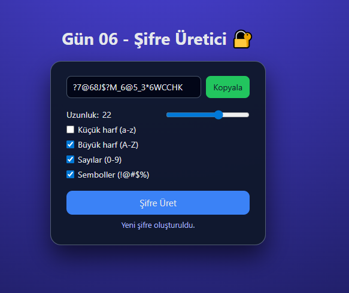

# Gün 06 – Şifre Üretici (Password Generator)

Bu proje, **30 Gün / 30 JavaScript Projects** serimin 6. gün projesidir.  
Amaç: Güçlü ve esnek bir şifre üretici oluşturarak, kullanıcıdan alınan ayarlara göre rastgele şifre üretmeyi öğrenmek.

---

## 🎯 Proje Özeti

Bu şifre üretici uygulaması:

- Şifre uzunluğunu **4–32** arasında slider ile seçmeye izin verir
- Aşağıdaki karakter türlerini isteğe bağlı olarak dahil eder:
  - Küçük harf (a-z)
  - Büyük harf (A-Z)
  - Sayılar (0-9)
  - Semboller (!@#$%&\*?-\_)
- “Şifre Üret” butonuna tıklanınca yeni bir şifre üretir
- “Kopyala” butonuna basıldığında üretilen şifreyi panoya kopyalar
- Kullanıcı hiçbir karakter türü seçmezse uyarı gösterir

Uygulama tamamen **HTML + CSS + Vanilla JavaScript** ile geliştirilmiştir.

---

## 🖼️ Ekran Görüntüsü

`assets` klasöründe yer alan ekran görüntüsü:



---

## 🛠️ Kullanılan Teknolojiler

- **HTML5**
- **CSS3**
- **Vanilla JavaScript**
- `Math.random()` ile rastgele seçim
- Checkbox ve range input kullanımı
- `navigator.clipboard.writeText` ile panoya kopyalama
- DOM üzerinden değer okuma ve yazma

---

## 📁 Proje Yapısı

```text
day-06-password-generator/
│── index.html
│── style.css
│── app.js
└── assets/
     └── screenshot.png
```
