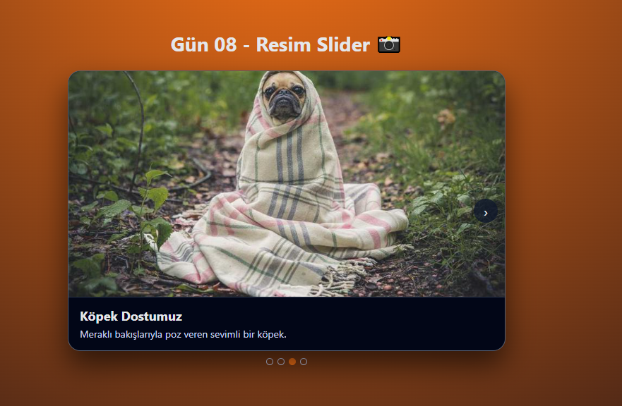

# Gün 08 – Resim Slider (Image Carousel)

Bu proje, **30 Gün / 30 JavaScript Projects** serimin 8. gün projesidir.  
Amaç: JavaScript ile slayt yapısı oluşturmak, ileri–geri gezinme mantığını anlamak, dot (navigasyon noktaları) kullanmak ve UI üzerinde dinamik içerik güncellemeyi öğrenmektir.

---

## 🎯 Proje Özeti

Bu resim slider uygulaması:

- İleri (›) ve geri (‹) butonları ile slayt değiştirir
- Alt tarafta dot (nokta) navigasyonu vardır
- Dot’lara tıklayarak istenen slayta geçilebilir
- Klavyedeki **sol-sağ ok tuşları** ile kontrol edilebilir
- Her slayt için:
  - Görsel
  - Başlık
  - Açıklama  
    bilgiler dinamiktir
- Modern, koyu temalı bir tasarım kullanılmıştır

Uygulama tamamen **HTML + CSS + Vanilla JavaScript** ile geliştirilmiştir.

---

## 🖼️ Ekran Görüntüsü

`assets` klasöründe bulunan ekran görüntüsü:

---

## 🛠️ Kullanılan Teknolojiler

- **HTML5**
- **CSS3**
- **Vanilla JavaScript**
- Dinamik DOM güncelleme
- Button + keyboard event handling
- Dot navigasyonu
- Object array yapısı ile slayt verisi yönetimi

---

## 📁 Proje Yapısı
