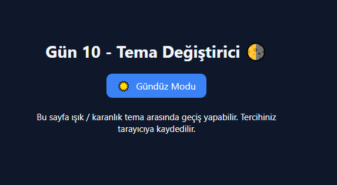

# Gün 10 – Tema Değiştirici (Dark / Light Mode Switch)

Bu proje, **30 Gün / 30 JavaScript Projects** serimin 10. gün projesidir.  
Amaç: Kullanıcının tek tıkla gece/gündüz temasını değiştirebildiği, tercihi localStorage üzerinde saklayan modern bir tema değiştirici geliştirmektir.

---

## 🎯 Proje Özeti

Bu tema değiştirici uygulaması:

- Tek butonla **light** ↔ **dark** teması arasında geçiş yapar
- Tema değiştiğinde ikon (🌙 / ☀️) ve metin otomatik güncellenir
- Kullanıcı tercihi **localStorage** üzerinde saklanır
- Sayfa yenilense bile seçilen tema korunur
- Arayüz tamamen modern ve animasyon geçişlidir

Uygulama tamamen **HTML + CSS + Vanilla JavaScript** ile geliştirilmiştir.

---

## 🖼️ Ekran Görüntüsü

`assets` klasöründe yer alır:




---

## 🛠️ Kullanılan Teknolojiler

- **HTML5**
- **CSS3**
- **JavaScript**
- localStorage kullanımı
- DOM manipülasyonu
- className üzerinden tema kontrolü
- Animasyonlu geçişler (color/background transitions)

---

## 📁 Proje Yapısı

```
day-10-theme-switch/
│── index.html
│── style.css
│── app.js
└── assets/
     └── screenshot.png
```

---

## 🚀 Çalıştırma

1. Projeyi indir veya klonla
2. `day-10-theme-switch` klasörünü aç
3. `index.html` dosyasını tarayıcıda çalıştır  
   (VS Code’da Live Server ile daha iyi görünür)

---

## 🎓 Öğrenilenler

- className ile tema yönetimi
- localStorage ile tema kalıcı hâle getirme
- Tıklama ile ikon/renk/metin değişimi
- Animasyonlu ve modern bir UI bileşeni oluşturma

---

Bu proje, 30 günlük JavaScript serisinin **10. günü**dür.
