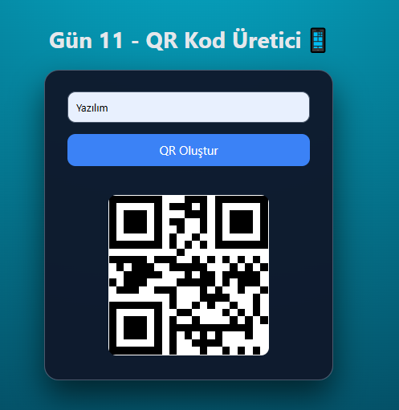

# Gün 11 – QR Kod Üretici (QR Code Generator)

Bu proje, **30 Gün / 30 JavaScript Projects** serimin 11. gün projesidir.  
Amaç: Kullanıcıdan alınan metni/URL’yi QR koda dönüştürmek ve dinamik olarak ekranda göstermek.

---

## 🎯 Proje Özeti

Bu QR kod üretici:

- Input alanına yazılan metin veya linkten QR kod üretir
- “QR Oluştur” butonuna basıldığında QR anında görünür
- Boş bırakılırsa kullanıcıya uyarı verir
- Enter tuşu ile de çalışır
- QR kodu gerçek zamanlı olarak bir API üzerinden oluşturulur
- Modern, koyu tema tasarımına sahiptir

Uygulama tamamen **HTML + CSS + Vanilla JavaScript** ile geliştirilmiştir.

---

## 🖼️ Ekran Görüntüsü

`assets` klasöründe yer alır:



---

## 🛠️ Kullanılan Teknolojiler

- **HTML5**
- **CSS3**
- **JavaScript**
- Fetch'siz basit QR API kullanımı
- Input/Enter event handling
- Dinamik `` güncelleme

---

## 📁 Proje Yapısı

```
day-11-qr-generator/
│── index.html
│── style.css
│── app.js
└── assets/
     └── screenshot.png
```

---

## 🚀 Çalıştırma

1. Projeyi indir veya klonla
2. `day-11-qr-generator` klasörünü aç
3. `index.html` dosyasını tarayıcıda aç  
   (Live Server önerilir)

---

## 🎓 Öğrenilenler

- QR kod API kullanımı
- Input değerini okuma
- Buton + Enter event yönetimi
- Hata mesajı gösterme
- Dinamik olarak img güncelleme

---

Bu proje, 30 günlük JavaScript serisinin **11. günü**dür.
