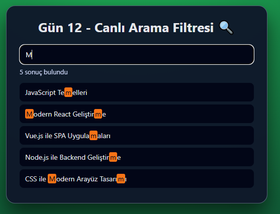

# Gün 12 – Canlı Arama Filtresi (Live Search Filter)

Bu proje, **30 Gün / 30 JavaScript Projects** serimin 12. gün projesidir.  
Amaç: Bir liste üzerinde, kullanıcı yazdıkça gerçek zamanlı arama filtresi oluşturmak ve eşleşen metinleri highlight etmeyi öğrenmektir.

---

## 🎯 Proje Özeti

Bu canlı arama filtresi uygulaması:

- Üstteki arama kutusuna yazdıkça alt listede anlık filtreleme yapar
- Eşleşmeyen kayıtları gizler
- Eşleşen kayıtların içindeki aranan kısmı **<mark>** ile renklendirir
- Alt tarafta:
  - Toplam kaç sonuç bulunduğu gösterilir
  - Hiç sonuç yoksa “Eşleşen sonuç bulunamadı.” mesajı çıkar
- Karanlık temalı, sade bir liste arayüzüne sahiptir

Uygulama tamamen **HTML + CSS + Vanilla JavaScript** ile geliştirilmiştir.

---

## 🖼️ Ekran Görüntüsü

`assets` klasöründe:



---

## 🛠️ Kullanılan Teknolojiler

- **HTML5**
- **CSS3**
- **JavaScript**
- Canlı arama (input `input` event'i)
- DOM üzerinden liste elemanlarını filtreleme
- `dataset` kullanımı (`data-label`)
- RegExp ile eşleşen kısımları `<mark>` ile işaretleme

---

## 📁 Proje Yapısı

```text
day-12-live-search/
│── index.html
│── style.css
│── app.js
└── assets/
     └── screenshot.png
```
