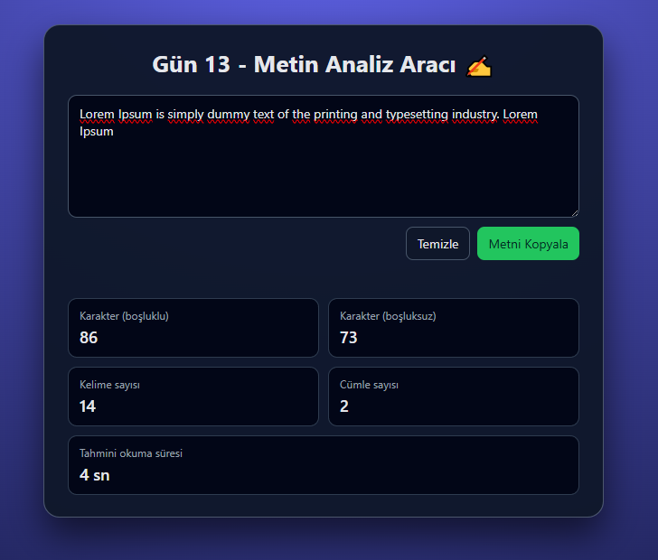

# Gün 13 – Metin Analiz Aracı (Text Analyzer)

Bu proje, **30 Gün / 30 JavaScript Projects** serimin 13. gün projesidir.  
Amaç: Kullanıcının yazdığı veya yapıştırdığı metin üzerinden anlık istatistikler üretmek ve metin analizini pratik etmek.

---

## 🎯 Proje Özeti

Bu metin analiz aracı:

- Girilen metni **anlık olarak** analiz eder
- Aşağıdaki bilgileri gösterir:
  - Karakter sayısı (boşluk dahil)
  - Karakter sayısı (boşluk hariç)
  - Kelime sayısı
  - Cümle sayısı
  - Tahmini okuma süresi (saniye cinsinden)
- “Temizle” butonu metni sıfırlar ve istatistikleri 0’a çeker
- “Metni Kopyala” butonu metni panoya kopyalar
- Mesaj alanı, kopyalama/temizleme gibi aksiyonlarda kullanıcıya geri bildirim verir

Uygulama tamamen **HTML + CSS + Vanilla JavaScript** ile geliştirilmiştir.

---

## 🖼️ Ekran Görüntüsü

`assets` klasöründe yer alır:



---

## 🛠️ Kullanılan Teknolojiler

- **HTML5**
- **CSS3**
- **JavaScript**
- String işlemleri (`length`, `split`, `replace`)
- Regular Expression (`RegExp`) kullanımı
- DOM manipülasyonu
- `navigator.clipboard.writeText` ile panoya kopyalama

---

## 📁 Proje Yapısı

```text
day-13-text-analyzer/
│── index.html
│── style.css
│── app.js
└── assets/
     └── screenshot.png
```
