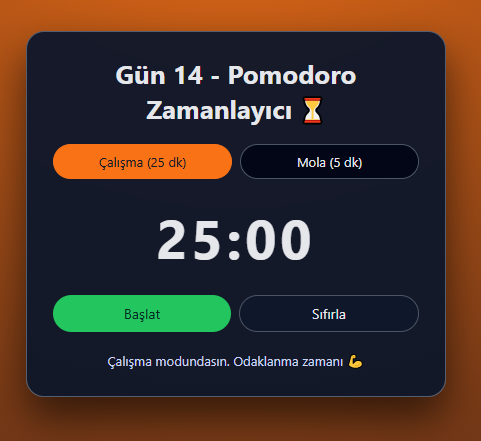

# Gün 14 – Pomodoro Zamanlayıcı (Pomodoro Timer)

Bu proje, **30 Gün / 30 JavaScript Projects** serimin 14. gün projesidir.  
Amaç: Pomodoro tekniğine uygun basit bir zamanlayıcı geliştirerek, zaman yönetimi ve `setInterval` kullanımı üzerine pratik yapmak.

---

## 🎯 Proje Özeti

Bu Pomodoro zamanlayıcı:

- İki mod içerir:
  - **Çalışma modu:** 25 dakika
  - **Mola modu:** 5 dakika
- Kullanıcı üstteki butonlardan mod seçebilir
- “Başlat” butonu ile zamanlayıcı çalışır, “Durdur” ile durur
- “Sıfırla” butonu seçili modun süresini başlangıca çeker
- Süre bittiğinde durum mesajında:
  - Çalışma bitince → “Mola zamanı!”
  - Mola bitince → “Tekrar çalışmaya hazırsın!” metni gösterilir
- Dakika:saniye formatında, büyük ve okunaklı zaman gösterimi vardır

Uygulama tamamen **HTML + CSS + Vanilla JavaScript** ile geliştirilmiştir.

---

## 🖼️ Ekran Görüntüsü

`assets` klasöründe:



---

## 🛠️ Kullanılan Teknolojiler

- **HTML5**
- **CSS3**
- **JavaScript**
- `setInterval` ile geri sayım mantığı
- Butonlarla mod ve state yönetimi
- class toggle ile aktif mod butonunu vurgulama
- Basit durum (state) yönetimi (`currentMode`, `remainingSeconds`, `isRunning`)

---

## 📁 Proje Yapısı

```text
day-14-pomodoro-timer/
│── index.html
│── style.css
│── app.js
└── assets/
     └── screenshot.png
```
