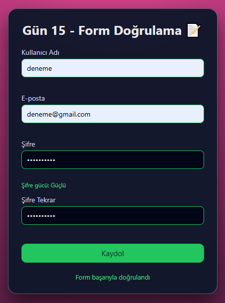

# Gün 15 – Form Doğrulama (Form Validator)

Bu proje, **30 Gün / 30 JavaScript Projects** serimin 15. gün projesidir.  
Amaç: Bir kayıt formu üzerinde temel validasyon kuralları uygulamak ve kullanıcıya anlık geri bildirim vermektir.

---

## 🎯 Proje Özeti

Bu form doğrulama uygulaması:

- Kullanıcı adı, e-posta, şifre ve şifre tekrar alanlarından oluşur
- Her alan için anlık (input event) ve submit anında kontrol yapılır
- Hatalı alanlar kırmızı border ve hata mesajı ile gösterilir
- Geçerli alanlar yeşil border ile işaretlenir
- Şifre için basit bir **güç göstergesi** (Zayıf / Orta / Güçlü) vardır
- Şifre tekrar alanı, şifreyle eşleşmek zorundadır
- Form başarılıysa kullanıcıya "Form başarıyla doğrulandı" mesajı gösterilir  
  (gerçek backend yok, demo amaçlıdır)

---

## 🖼️ Ekran Görüntüsü

`assets` klasöründe:



---

## 🛠️ Kullanılan Teknolojiler

- **HTML5**
- **CSS3**
- **Vanilla JavaScript**
- Basit regex ile e-posta kontrolü
- Şifre gücü hesaplama (uzunluk, büyük harf, rakam, sembol)
- class yönetimi (`error`, `success`)
- Canlı validasyon (input + submit event'leri)

---

## 📁 Proje Yapısı

```text
day-15-form-validator/
│── index.html
│── style.css
│── app.js
└── assets/
     └── screenshot.png
```
