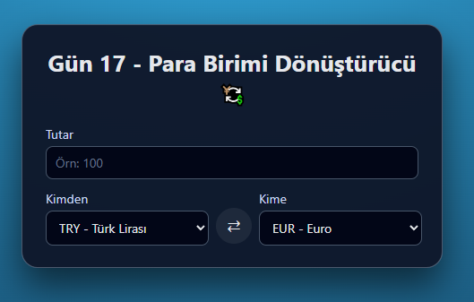

# Gün 17 – Para Birimi Dönüştürücü (Currency Converter)

Bu proje, **30 Gün / 30 JavaScript Projects** serimin 17. gün projesidir.  
Amaç: Girilen tutarı seçilen iki para birimi arasında dönüştüren basit bir arayüz geliştirmektir.

---

## 🎯 Proje Özeti

Bu döviz çevirici:

- Kullanıcıdan;
  - Tutar
  - Kaynak para birimi (From)
  - Hedef para birimi (To)
    alır
- “Dönüştür” butonuna basıldığında;
  - Girilen tutarı seçilen para birimine çevirir
  - **Dönüşen tutarı** gösterir
  - Altta **1 FROM ≈ X TO** şeklinde kur bilgisini yazar
- Geçersiz / eksik girişlerde uyarı mesajı gösterir
- Para birimlerini ⇄ butonu ile tek tıklamada yer değiştirebilirsin
- Enter tuşu ile de hesaplama yapılabilir

Uygulama tamamen **HTML + CSS + Vanilla JavaScript** ile geliştirilmiştir.  
Kur bilgileri demo amaçlı, sabit bir `rates` objesi üzerinden alınmaktadır.

---

## 🖼️ Ekran Görüntüsü

`assets` klasöründe yer alır:



---

## 🛠️ Kullanılan Teknolojiler

- **HTML5**
- **CSS3**
- **JavaScript**
- `select` ile dropdown kullanımı
- Nesne tabanlı sabit kur tablosu (`rates` objesi)
- Basit matematiksel dönüşüm:
  - TRY baz alınarak farklı para birimleri arasında çeviri
- DOM manipülasyonu ile:
  - Sonuç ve kur bilgisini ekrana yazma
- Enter ve buton event’leri

---

## 📁 Proje Yapısı

```text
day-17-currency-converter/
│── index.html
│── style.css
│── app.js
└── assets/
     └── screenshot.png
```
