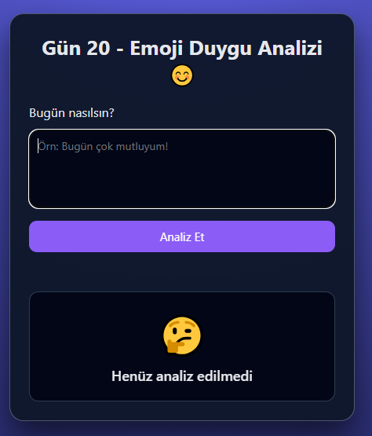

# Gün 20 – Emoji Mood Analyzer

Bu proje, **30 Gün / 30 JavaScript Projects** serimin 20. günüdür.  
Amaç: Kullanıcının yazdığı metni analiz edip duygusuna uygun bir emoji ve açıklama göstermek.

---

## 🎯 Özellikler

- Metin içindeki duygu kelimelerini analiz eder
- Mutlu / üzgün / sinirli / yorgun / heyecanlı / bilinmeyen
- Emoji + açıklama çıktısı
- Enter ile çalışır
- Eğlenceli ve kullanışlı bir mini NLP (metin analizi) örneği

---

## 🖼️ Ekran Görüntüsü

`assets` klasöründe yer alır:



---

## 🛠️ Kullanılan Teknolojiler

- HTML5 (`textarea`)
- CSS3 (modern card tasarımı)
- JavaScript:
  - Basit duygu sözlüğü (`moodMap`)
  - Metin içinde anahtar kelime arama (`includes`)
  - Dinamik emoji & text güncelleme

---

## 📁 Proje Yapısı

```text
day-20-emoji-mood-analyzer/
│── index.html
│── style.css
│── app.js
└── assets/
     └── screenshot.pn
```
