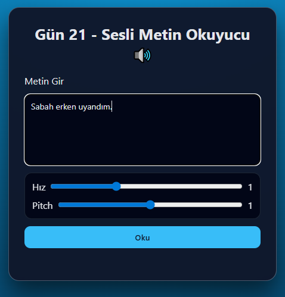

# Gün 21 – Text to Speech (Sesli Metin Okuyucu)

Bu proje, **30 Gün / 30 JavaScript Projects** serimin 21. günüdür.

Amaç: Kullanıcının yazdığı metni, tarayıcının **Speech Synthesis API** özelliğini kullanarak sesli şekilde okutan bir araç geliştirmektir.

---

## 🎯 Özellikler

- Metin alanına yazılan yazıyı sesli okur
- Hız ayarı (0.5 – 2.0)
- Pitch (ses tonu) ayarı (0 – 2)
- Enter tuşu ile okuma
- Speech Synthesis API kullanımı
- Modern card tasarımı

---

## 🖼️ Ekran Görüntüsü

`assets` klasöründe yer alır:



---

## 🛠️ Kullanılan Teknolojiler

- HTML5 (`textarea`, `range input`)
- CSS3 (modern UI, kart tasarımı)
- JavaScript:
  - `SpeechSynthesisUtterance`
  - Rate & Pitch slider kontrolü
  - Button & Enter event’leri
  - Dynamic DOM güncellemeleri

---

## 📁 Proje Yapısı

```text
day-21-text-to-speech/
│── index.html
│── style.css
│── app.js
└── assets/
     └── screenshot.png
```
