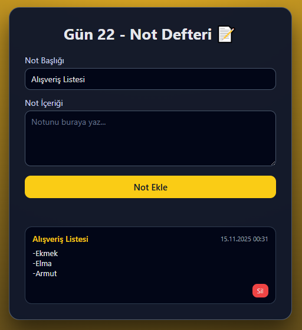

# Gün 22 – Not Defteri (Notes App)

Bu proje, **30 Gün / 30 JavaScript Projects** serimin 22. günüdür.

Amaç: Kullanıcının hızlıca not ekleyebildiği, notları listeleyebildiği ve tarayıcı kapansa bile kaybolmaması için **localStorage** üzerinde saklayan basit bir not uygulaması geliştirmektir.

---

## 🎯 Özellikler

- Başlık + içerik alanı ile yeni not ekleme
- Eklenen notları kartlar halinde listeleme
- Her not için oluşturulma tarihini gösterme
- Notları tek tıkla silme
- Tüm notları `localStorage` içinde saklama (sayfa yenilense bile kaybolmaz)
- Ctrl+Enter veya Enter (başlık alanındayken) ile hızlı not ekleme kısayolu

---

## 🖼️ Ekran Görüntüsü

`assets` klasöründe yer alır:



---

## 🛠️ Kullanılan Teknolojiler

- HTML5
  - `input` ve `textarea` ile form benzeri giriş alanları
- CSS3
  - Kart tabanlı not tasarımı
  - Scrollbar, buton ve layout düzenleri
- JavaScript
  - `localStorage` ile veri saklama
  - Not ekleme / silme için dizi manipülasyonu
  - `Date` ile tarih formatlama
  - DOM üzerinde dinamik kart oluşturma ve event listener kullanımı

---

## 📁 Proje Yapısı

```text
day-22-notes-app/
│── index.html
│── style.css
│── app.js
└── assets/
     └── screenshot.png
```
