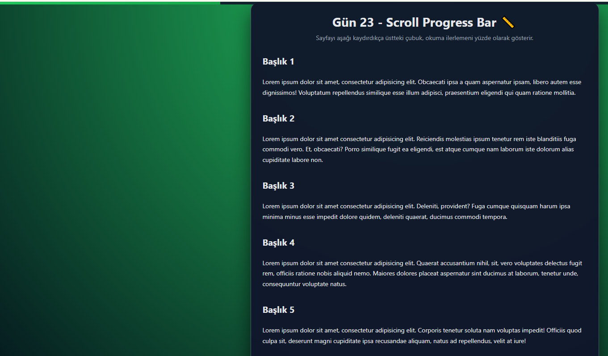

# Gün 23 – Scroll Progress Bar (Sayfa Kaydırma İlerleme Çubuğu)

Bu proje, **30 Gün / 30 JavaScript Projects** serimin 23. günüdür.

Amaç: Kullanıcı sayfayı aşağı kaydıkça, okuma ilerlemesini üstte ince bir çubuk ile yüzde olarak gösteren ve belirli bir noktadan sonra görünen “Yukarı Çık” butonuna sahip küçük bir arayüz geliştirmektir.

---

## 🎯 Özellikler

- Sayfa kaydıkça üstteki progress bar %0–100 arası doluluk gösterir
- Scroll miktarına göre dinamik genişlik hesaplanır
- Belirli bir scroll mesafesinden sonra sağ altta “Yukarı Çık” butonu görünür
- “Yukarı Çık” butonuna basıldığında sayfa yumuşak animasyon ile en üste kayar (`scrollTo({ behavior: "smooth" })`)
- Tamamen statik HTML sayfası üzerinde çalışır, ek kütüphane gerektirmez

---

## 🖼️ Ekran Görüntüsü

`assets` klasöründe yer alır:



---

## 🛠️ Kullanılan Teknolojiler

- HTML5
  - Başlık ve dummy içerik bölümleri
- CSS3
  - Sabit üst progress bar tasarımı
  - Kart görünümlü içerik alanı
  - Sağ altta yuvarlak “Yukarı Çık” butonu
- JavaScript
  - `scroll` event listener ile scroll yüzdesi hesaplama
  - `document.documentElement.scrollHeight` ve `clientHeight` kullanımı
  - `scrollTo({ top: 0, behavior: "smooth" })` ile yumuşak yukarı kaydırma
  - DOM üzerinden progress bar genişliğini ve buton görünürlüğünü güncelleme

---

## 📁 Proje Yapısı

```text
day-23-scroll-progress/
│── index.html
│── style.css
│── app.js
└── assets/
     └── screenshot.png
```
