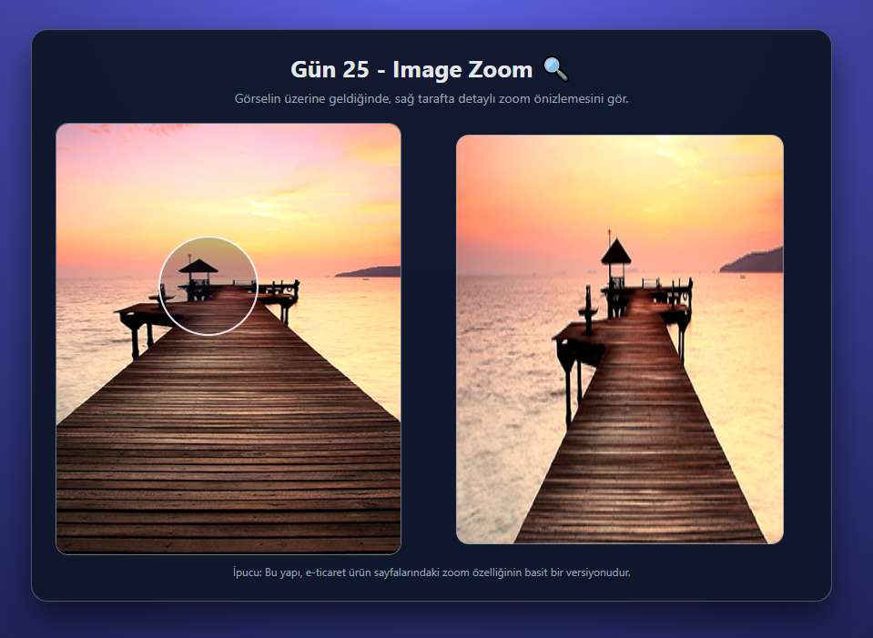

# Gün 25 – Image Zoom (Hover ile Görsel Büyütme)

Bu proje, **30 Gün / 30 JavaScript Projects** serimin 25. günüdür.

Amaç: Kullanıcı bir ürün görselinin üzerine geldiğinde, ayrı bir alanda **zoom önizleme** görebildiği, e-ticaret sitelerindeki ürün zoom özelliğinin basit bir versiyonunu geliştirmektir.

---

## 🎯 Özellikler

- Ürün görseli üzerinde fareyi gezdirince büyütülmüş detayları sağ tarafta gösterir
- Mouse konumuna göre hareket eden yarı saydam bir **lens (mercek)** alanı
- Lens’in merkezi, zoom önizlemenin odağını temsil eder
- Görsel dışına çıkmayı engelleyen sınır kontrolü
- Zoom alanı, arka planda aynı görseli daha büyük boyutta (`background-size`) kullanır
- Hem mouse hem de touch (mobil) olaylarını destekleyecek basit dokunmatik desteği

---

## 🖼️ Ekran Görüntüsü

`assets` klasöründe yer alır:



---

## 🛠️ Kullanılan Teknolojiler

- HTML5
  - Ana görsel ve zoom önizleme alanı için yapısal iskelet
- CSS3
  - Grid layout ile sol/sağ bölmeli kart tasarımı
  - Görsel çerçevesi, lens yuvarlak alanı ve zoom kutusu tasarımı
  - `background-size` ve `background-position` ile zoom efekti
- JavaScript
  - Mouse pozisyonunu hesaplamak için `getBoundingClientRect` kullanımı
  - Lens’in pozisyonunu sınırlamak için temel matematiksel kontroller
  - Mouse hareketi (`mousemove`), giriş/çıkış (`mouseenter`, `mouseleave`) event’leri
  - Dokunmatik destek için `touchstart`, `touchmove`, `touchend` event’leri
  - Zoom kutusunda dinamik `background-position` güncelleme

---

## 📁 Proje Yapısı

```text
day-25-image-zoom/
│── index.html
│── style.css
│── app.js
└── assets/
     └── product.jpg
```
