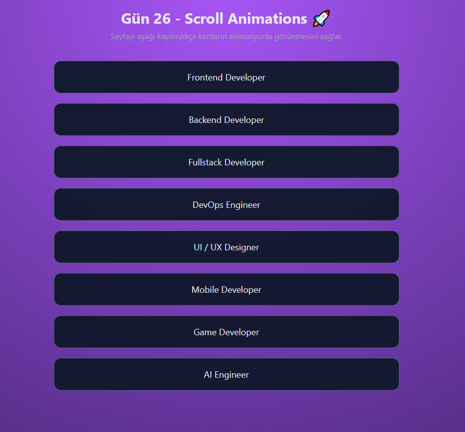

# Gün 26 – Scroll Animations (Kaydırınca Çıkan Animasyonlar)

Bu proje, **30 Gün / 30 JavaScript Projects** serimin 26. günüdür.

Amaç: Kullanıcı sayfada aşağıya kaydıkça belirli kartların animasyonla görünmesini sağlayan modern bir scroll animasyon sistemi oluşturmaktır.

---

## 🎯 Özellikler

- Scroll yaptıkça kartlar yumuşak animasyonla görünür
- Kartlar ilk başta “hidden” sınıfıyla aşağıya kaymış halde başlar
- Element görünür hale geldiğinde `IntersectionObserver` tetiklenir
- Görünen kartların animasyonu bir daha tetiklenmez (performans için iyi)
- Modern web sitelerinde sık kullanılan bir efekt

---

## 🖼️ Ekran Görüntüsü

`assets` klasöründe yer alır:



---

## 🛠️ Kullanılan Teknolojiler

- HTML5
- CSS3 (opacity + translateY animasyonu)
- JavaScript
  - `IntersectionObserver` API
  - DOM manipülasyonu
  - Performans odaklı gözlem sistemi

---

## 📁 Proje Yapısı

```text
day-26-scroll-animations/
│── index.html
│── style.css
│── app.js
└── assets/
     └── screenshot.png
```
