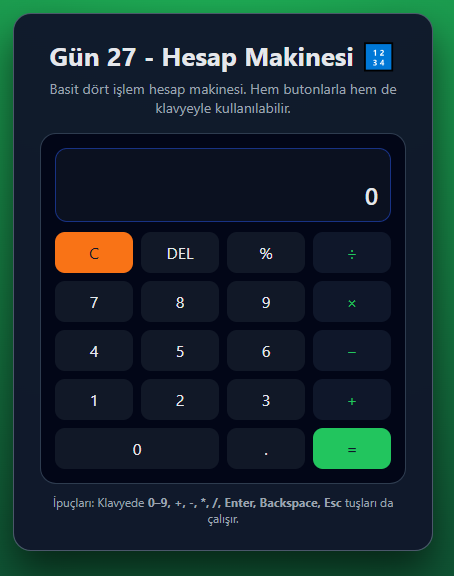

# Gün 27 – Calculator (Hesap Makinesi)

Bu proje, **30 Gün / 30 JavaScript Projects** serimin 27. günüdür.

Amaç: Dört işlem yapabilen, hem butonlarla hem de klavye ile kullanılabilen basit bir **hesap makinesi** arayüzü geliştirmektir.

---

## 🎯 Özellikler

- 0–9 sayıları, `+`, `-`, `×`, `÷`, `%` işlemleri
- Ondalık sayılar için `.` (virgül yerine nokta) desteği
- `C` ile tümünü temizleme, `DEL` ile son haneyi silme
- Ekranda:
  - Üst satırda önceki değer + seçili işlem (`12 +`)
  - Alt satırda aktif sayı veya sonuç
- Bölme işleminde 0’a bölme yapılırsa “Hata” mesajı gösterir
- Klavye desteği:
  - Rakamlar → 0–9
  - `+ - * /` → işlemler
  - `Enter` veya `=` → hesapla
  - `Backspace` → son haneyi sil
  - `Esc` → sıfırla

---

## 🖼️ Ekran Görüntüsü

`assets` klasöründe yer alır:



---

## 🛠️ Kullanılan Teknolojiler

- HTML5
  - Butonların `data-*` attribute’ları ile ayrılması (data-number, data-operator, data-equals…)
- CSS3
  - Kart tabanlı hesap makinesi tasarımı
  - Grid ile 4x5 buton yerleşimi
  - Operatör, eşittir ve temizleme butonlarına farklı renkler
- JavaScript
  - Durum yönetimi için değişkenler:
    - `currentOperand`, `previousOperand`, `operation`, `justCalculated`
  - `appendNumber`, `chooseOperation`, `compute`, `deleteDigit`, `clearAll` fonksiyonları
  - Ondalık ve uzun sonuçlar için basit formatlama (`Math.round`)
  - Klavye event’leri ile butonlara karşılık gelen fonksiyonların tetiklenmesi

---

## 📁 Proje Yapısı

```text
day-27-calculator/
│── index.html
│── style.css
│── app.js
└── assets/
     └── screenshot.png
```
