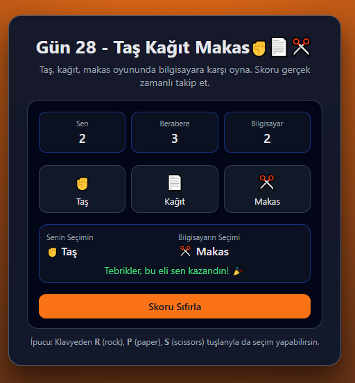

# Gün 28 – Rock Paper Scissors (Taş Kağıt Makas Oyunu)

Bu proje, **30 Gün / 30 JavaScript Projects** serimin 28. günüdür.

Amaç: Kullanıcının bilgisayara karşı klasik **Taş – Kağıt – Makas** oyununu oynayabildiği, skorların gerçek zamanlı tutulduğu basit bir oyun arayüzü geliştirmektir.

---

## 🎯 Özellikler

- Kullanıcı, taş / kağıt / makas seçimlerini butonlar üzerinden yapar
- Bilgisayar her el için rastgele bir seçim yapar
- Her elin sonucu:
  - Sen kazandın / Bilgisayar kazandı / Berabere  
    olarak ekranda gösterilir
- Skor tablosu:
  - Senin skorun
  - Bilgisayar skoru
  - Berabere sayısı  
    ayrı ayrı tutulur
- “Skoru Sıfırla” butonu ile oyun sıfırlanabilir
- Klavye kısayolları:
  - `R` → Rock (Taş)
  - `P` → Paper (Kağıt)
  - `S` → Scissors (Makas)

---

## 🖼️ Ekran Görüntüsü

`assets` klasöründe yer alır:



---

## 🛠️ Kullanılan Teknolojiler

- HTML5
  - Butonlar, skor alanları ve sonuç paneli yapısı
- CSS3
  - Kart tabanlı oyun arayüzü
  - Skor kutuları, seçim butonları ve renkli sonuç durumları
- JavaScript
  - Oyun mantığı:
    - `getComputerChoice` ile rastgele seçim
    - `getResult` ile kazananı belirleme
  - Skor takibi için değişkenler (`playerScore`, `computerScore`, `drawScore`)
  - DOM manipülasyonu ile son seçimlerin ve skorların ekrana yazılması
  - Klavye event’leri ile R / P / S kısayollarının kullanılması

---

## 📁 Proje Yapısı

```text
day-28-rock-paper-scissors/
│── index.html
│── style.css
│── app.js
└── assets/
     └── screenshot.png
```
