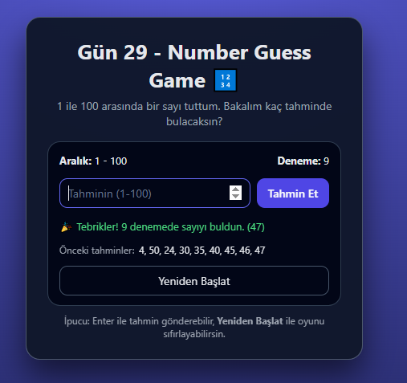

# Gün 29 – Number Guess Game (Sayı Tahmin Oyunu)

Bu proje, **30 Gün / 30 JavaScript Projects** serimin 29. günüdür.

Amaç: Bilgisayarın 1 ile 100 arasında tuttuğu sayıyı, kullanıcının tahmin ederek bulmaya çalıştığı basit bir sayı tahmin oyunu geliştirmektir.

---

## 🎯 Özellikler

- Oyun 1–100 arasında rastgele bir sayı üretir
- Kullanıcı input alanına tahminini girer ve **“Tahmin Et”** butonuna basar
- Her tahminden sonra:
  - Sayı daha **büyük** mü olmalı, **küçük** mü olmalı bilgisi verilir
  - Toplam deneme sayısı güncellenir
  - Önceki tahminler listelenir
- Sayı doğru tahmin edildiğinde:
  - Tebrik mesajı ve toplam deneme sayısı gösterilir
  - Oyun biter, istenirse **“Yeniden Başlat”** ile yeni oyun başlar
- Geçersiz girişlerde:
  - Boş / sayı olmayan girişler
  - Aralık dışı (1–100 dışı) değerler  
    için hata mesajı gösterilir
- Klavye desteği:
  - `Enter` → tahmin gönderme

---

## 🖼️ Ekran Görüntüsü

`assets` klasöründe yer alır:



---

## 🛠️ Kullanılan Teknolojiler

- HTML5
  - Sayı inputu (`input type="number"`)
  - Bilgi, mesaj ve önceki tahminler için basit yapı
- CSS3
  - Kart tabanlı oyun arayüzü
  - Mesajlar için durum renkleri (bilgi / hata / başarı)
- JavaScript
  - Rastgele sayı üretmek için `Math.random` + `Math.floor`
  - Oyun state değişkenleri:
    - `secretNumber`, `attempts`, `isGameOver`, `previousGuesses`
  - Tahmin kontrolü ve aralık doğrulama
  - DOM manipülasyonu ile deneme sayısı, önceki tahminler ve mesajların güncellenmesi
  - Enter tuşu ile tahmin gönderme (`keydown` event)

---

## 📁 Proje Yapısı

```text
day-29-number-guess/
│── index.html
│── style.css
│── app.js
└── assets/
     └── screenshot.png
```
