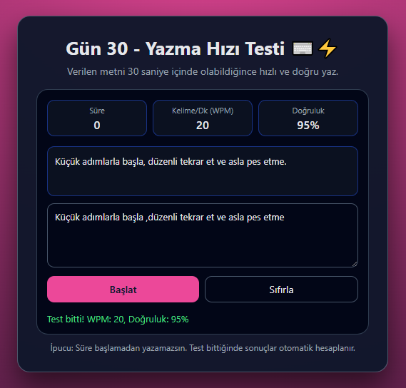

# Gün 30 – Typing Speed Test (Yazma Hız Testi)

Bu proje, **30 Gün / 30 JavaScript Projects** serimin 30. ve son gün projesidir.

Amaç: Verilen metni belirli bir süre içinde yazarak, kullanıcının **yazma hızını (WPM)** ve **doğruluk oranını** ölçen basit bir yazma hız testi geliştirmektir.

---

## 🎯 Özellikler

- Test süresi: varsayılan olarak **30 saniye**
- Test başladığında:
  - Rastgele bir örnek cümle ekranda gösterilir
  - Kullanıcı sadece bu cümleyi yazmaya çalışır
- Gerçek zamanlı üst bilgi paneli:
  - Kalan süre (saniye)
  - Kelime/dakika (WPM – test bitince hesaplanır)
  - Doğruluk oranı (yazılan karakterlerin doğru olan yüzdesi)
- Kullanıcı yazarken:
  - Toplam yazılan karakter ve doğru karakter sayısı takip edilir
- Süre bittiğinde:
  - Yazma alanı kilitlenir
  - WPM ve doğruluk oranı hesaplanır ve ekranda gösterilir
- “Sıfırla” butonu ile:
  - Yeni bir rastgele cümle gelir
  - Süre, skorlar ve yazma alanı sıfırlanır
- Klavye desteği:
  - Test duruyorken `Enter` ile de başlatılabilir

---

## 🖼️ Ekran Görüntüsü

`assets` klasöründe yer alır:



---

## 🛠️ Kullanılan Teknolojiler

- HTML5
  - Üst bilgi paneli, hedef metin alanı, textarea ve buton yapıları
- CSS3
  - Kart tabanlı layout
  - Bilgi kutuları (süre, WPM, doğruluk) için grid yapısı
  - Farklı mesaj durumları için basit renk vurguları
- JavaScript
  - Rastgele cümle seçimi için sabit bir cümle dizisi
  - Zamanlayıcı için `setInterval` ve kalan süre yönetimi
  - WPM hesabı:
    - Toplam yazılan kelime / süre (dakika cinsinden)
  - Doğruluk hesabı:
    - Kullanıcının yazdığı karakterler ile hedef metnin karakter bazlı karşılaştırılması
  - Oyun durumu değişkenleri:
    - `timeLeft`, `isRunning`, `totalTyped`, `correctTyped`
  - DOM manipülasyonu ile süre, skorlar ve mesajların dinamik güncellenmesi

---

## 📁 Proje Yapısı

```text
day-30-typing-test/
│── index.html
│── style.css
│── app.js
└── assets/
     └── screenshot.png
```
